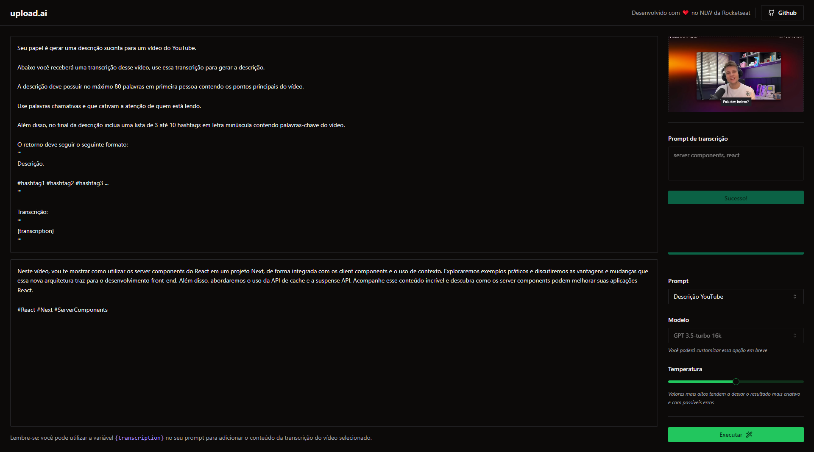

<h1 align="center">upload.ai</h1>

<p align="center">
  
</p>

<br>

<p align="center">
  
</p>

## 💻 Projeto

Aplicação que possibilita realizar upload de videos e por meio de IA, criar automaticamente títulos chamativos e descrições com um boa indexação.

## 🧪 Tecnologias

Esse projeto foi desenvolvido com as seguintes tecnologias:

- [React](https://react.dev/)
- [TypeScript](https://www.typescriptlang.org/)
- [Tailwind CSS](https://tailwindcss.com/)
- [Shadcn/ui](https://ui.shadcn.com/)
- [Prisma](https://www.prisma.io/)
- [Fastify](https://fastify.dev/)

## 🚀 Como executar

```bash
# Clone este repositório
$ git clone https://github.com/jhonathanalencar/upload-ai.git

# Entre na pasta do servidor
$ cd upload-ai/api

# Instale as dependências
$ npm install

# Copie e preencha as variáveis de ambiente do arquivo .env.example em um arquivo .env

# Execute o servidor em modo de desenvolvimento
$ npm run dev

# O servidor iniciará na porta:3333
acesse <http://localhost:3333>

# Entre na pasta da aplicação web
$ cd upload-ai/web

# Instale as dependências
$ npm install

# Copie e preencha as variáveis de ambiente do arquivo .env.example em um arquivo .env

# Execute a aplicação em modo de desenvolvimento
$ npm run dev

# A aplicação inciará na porta:5173
acesse <http://localhost:5173>
```

## 📝 Licença

Esse projeto está sob a licença MIT. Veja o arquivo [LICENSE](LICENSE) para mais detalhes.

---

<p align="center">
  
</p>
